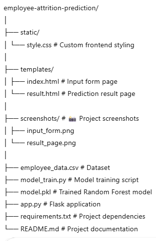
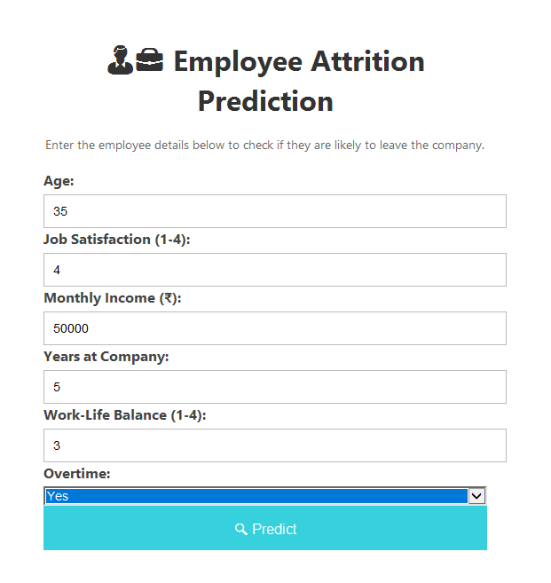
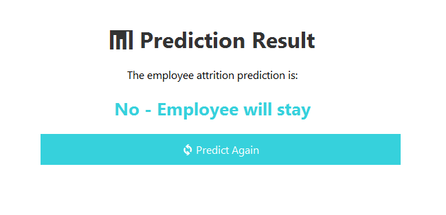

#  Employee Attrition Prediction Web App

A **Flask-based Machine Learning web application** that predicts whether an employee will **leave the company or stay** based on various job and personal attributes.  
The prediction is powered by a **Random Forest Classifier**.

---

##  Overview
Employee attrition (staff turnover) is a major concern for many organizations.  
This project helps predict the likelihood of an employee leaving based on features such as:
- Age
- Job Satisfaction
- Monthly Income
- Years at Company
- Work-Life Balance
- Overtime status

The web app provides **instant predictions** via a clean and responsive interface.

---

##  Features
-  Predicts whether an employee will **stay or leave**
-  Uses a **Random Forest Classifier** for accurate results
-  Dataset stored in CSV format for easy updates
-  Clean, **responsive frontend** built with HTML & CSS
-  Real-time predictions powered by Flask
-  Easy to customize with your own dataset

---

##  Tech Stack
- **Python 3.10+**
- **Flask**
- **scikit-learn**
- **pandas**
- **HTML/CSS**

---

##  Project Structure

---

##  Installation & Setup

### 1️ Clone the Repository

git clone https://github.com/yourusername/employee-attrition-prediction.gitcdemployee-attrition-prediction

### 2️ Install Dependencies

pip install -r requirements.txt
### 3️ Train the Model

python model_train.py
This will create the model.pkl file.

### 4️ Run the Web App

python app.py
Open your browser and go to:

http://127.0.0.1:5000/

##  Screenshots

###  Input Form

###  Prediction Result

###  Use Cases

 - HR departments to analyze and prevent employee turnover

 - Data-driven decision making in workforce management

 - Educational projects demonstrating ML in HR analytics

###  Future Enhancements

 - Add more features like department, distance from home, education level

 - Deploy online via Heroku, Render, or Streamlit

 - Implement visual analytics dashboard

